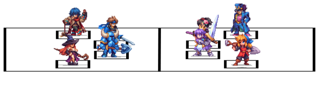
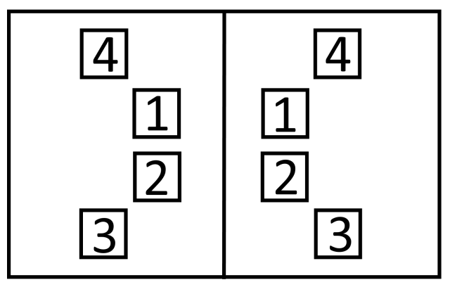

# UDG Battle System

## Example Images

## Overview

### Minimum requirements

| Type | Group1(Protaganists) | Group2(Antaganists) |
| ---- | -------------------- | ------------------- |
| PVE  | 1 player             | 1 NPC               |
| PVP  | 1 player             | 1 player            |

### Maximum Capacity

| Type | Group1(Protaganists) | Group2(Antaganists) |
| ---- | -------------------- | ------------------- |
| PVE  | 4 players            | 4 NPC               |
| PVP  | 4 players            | 4 players           |

### Battle Process

**in PVE Player always takes action first**

**in PVP Coin flip to determine which group acts first**

Starting with the side that takes action first each side will take one action in turns
one entity from that side will take an action starting with the entity in position 1.

Battle will continue until all entities on one side have perished.

## Client Side

### Actions

During a players turn they get up to 30 seconds to take an action.

#### Action Types

Players can choose between the following types of actions

> Normal Attack

> Use a skill

> Use an item

## Sever Side

### Party Integration

## Use for later

| Type | Group1(Protaganists) | Group2(Antaganists) |
| ---- | -------------------- | ------------------- |
|      |                      |                     |

|     |     |     |     |     |
| --- | --- | --- | --- | --- |
|     |     |     |     |     |
|     |     |     |     |     |
|     |     |     |     |     |
